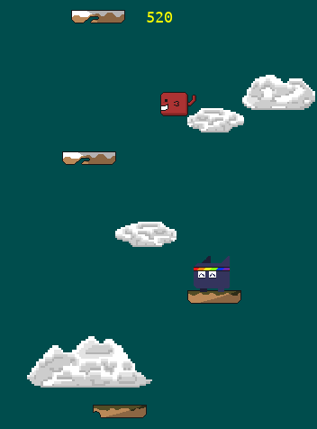

# My PyGames

 

 ---
 
 ### Plattformspiel
 
 
**Sobre**:  
O objetivo deste jogo é ajudar o jovem Pipipopo a chegar no topo da Montanha por meio da escalada de plataformas.  
Você pode baixar o executável desse jogo tanto para Windows quanto para Linux clicando [aqui](https://wercton.itch.io/plattformspiel).
  
 ---
 
