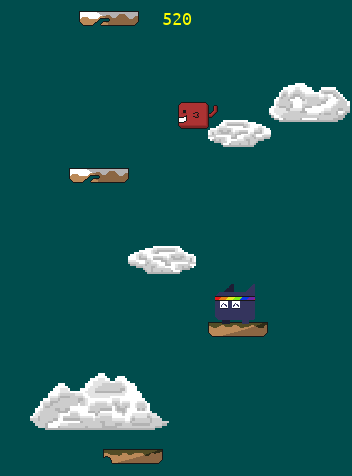

<p align="center">
  <a href="https://www.hackerrank.com/werctonmatheus">
    
  </a>
</p>

# Plattformspiel

[](https://github.com/Wercton/My-PyGames)
[](https://github.com/Wercton/My-PyGames) 
[](https://github.com/Wercton/My-PyGames)

---



## Sobre

O objetivo deste jogo é ajudar o jovem Pipipopo a chegar no topo da Montanha por meio da escalada de plataformas.  
Você pode baixar o executável desse jogo tanto para Windows quanto para Linux clicando [aqui](https://wercton.itch.io/plattformspiel).

---

## Estrutura do Projeto

```
Plattformspiel/
├── assets/
│   ├── imagens/
│   ├── audio/
│   └── printscreen/
├── src/
│   ├── main.py
│   ├── config.py
│   ├── game/
│   │   ├── interface.py
│   │   ├── game.py
│   │   ├── player.py
│   │   └── objects/
│   │        ├── mob.py
│   │        ├── cloud.py
│   │        ├── platform.py
│   │        ├── powerup.py
│   │        └── spritesheet.py
├── requirements.txt
├── .gitignore
└── README.md
```

## Instalação

1. **Clone o repositório:**
   ```bash
   git clone https://github.com/seu-usuario/Plattformspiel.git
   cd Plattformspiel
   ```

2. **Crie e ative um ambiente virtual (opcional, recomendado):**
   ```bash
   python3 -m venv venv
   source venv/bin/activate
   ```

3. **Instale as dependências:**
   ```bash
   pip install -r requirements.txt
   ```

## Como executar

Execute o jogo a partir da raiz do projeto usando:

```bash
python -m src.main
```

## Requisitos

- Python 3.8+
- pygame

## Recursos

- Imagens e áudio estão na pasta `assets/`.
- Código-fonte está em `src/`.

## Contribuição

Sinta-se livre para abrir issues ou enviar pull requests!

## Licença

Este projeto está licenciado sob a licença MIT. Veja o arquivo [LICENSE](LICENSE) para mais detalhes.

